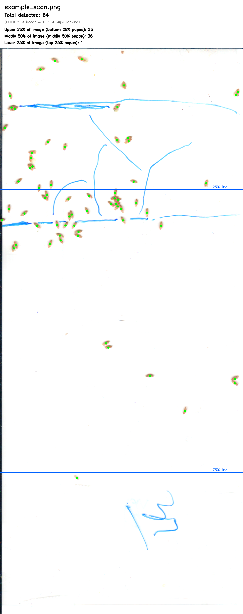

# Pupa Counter (v11)

Automatic silkworm-pupa counter for 300 dpi paper-sheet scans, built on a
lightweight U-Net (466K params). **v11 default** (warm-started from v6,
trained on 99 hand-corrected scans, ~10,172 sure labels after a manual
label-cleanup pass). v6 and v7 shipped as reference checkpoints.

One command per scan: you get an annotated PNG and a running Excel log of
counts. No cloud service, no API key, all inference runs locally on CPU,
CUDA, or Apple Silicon (MPS).

```
python pupa_counter.py examples/example_scan.png
```



## What it does

For every scan you feed it, the program:

1. Runs the v11 CNN and extracts candidate pupa center locations.
2. **Runs a 2nd-stage classifier on each candidate to drop false
   positives** (stains, ink shadows, dirt). Disable with `--no-filter`.
3. Draws a green dot on each confirmed pupa.
4. Computes **three rank percentile lines** at 5%, 25%, 75% of the
   detected-pupa Y range (not the image height — the topmost/bottommost
   detected pupa define 0% / 100%).
5. Reports pupa counts in four bands.
6. Saves the annotated image to `output/`.
7. Appends one row to `output/pupa_counts.xlsx` — re-run it on new scans
   and the Excel keeps growing.

The rank convention follows the lab's sorting workflow where the **top of
the pupa ranking is at the BOTTOM of the image**:

| Image Y-coord | Rank % | Meaning |
|---|---|---|
| Bottommost pupa  | 0%   | Best pupa (top of ranking) |
| Topmost pupa     | 100% | Worst pupa (bottom of ranking) |

Four regions & counts reported:

| Band       | Meaning |
|---|---|
| Rank 0 - 5%    | Top 5% best pupae (red line in image) |
| Rank 5 - 25%   | Next tier |
| Rank 25 - 75%  | Middle 50% |
| Rank 75 - 100% | Bottom 25% worst pupae |

The 5% line is drawn in red; 25% and 75% in orange.

## Accuracy

Two-stage pipeline: CNN detector + peak-level classifier.

| Pipeline | Self-eval F1 on 99 scans (cleaned labels) | Precision | Recall |
|---|---|---|---|
| v11 CNN only | 97.89% | 96.96% | 98.83% |
| **v11 CNN + classifier filter** (default) | **99.41%** | **100.00%** | **98.83%** |
| v6 CNN + classifier v3 (legacy) | 99.22% | 99.87% | 98.58% |

The 2nd-stage classifier (`model/peak_filter_clf.pkl`, ~360 KB) is a
Gradient Boosting model trained on all 99 labeled scans using v11's own
detection outputs. At the default `threshold=0.60` it kills **100% of
false positives** (315 → 0 across 99 scans) while losing **zero** true
positives. Net F1 gain over raw CNN: **+1.52pp**.

The 119 remaining misses are overwhelmingly edge pupae (81 within 30px of
image border, 72 of those on the left edge where the scanner tends to
cut pupae in half). These are largely a physical/hardware limit — half a
pupa is hard to detect unambiguously.

**Why v11 over v6:** v11 was retrained on 99 cleaned scans (vs v6's 60
old labels), using v6 as warm-start init, with no other recipe changes.
Paired with a classifier trained specifically on v11's FP distribution,
the combo reaches perfect precision on self-eval while holding recall.
v6 (`model/pupa_counter_v6.pt`) and v7 (`model/pupa_counter_v7.pt`) are
retained as reference checkpoints — pass `--model model/pupa_counter_v6.pt`
to reproduce prior numbers. Note: pairing v6 with the new classifier
produces a mismatched combo; use `model/peak_filter_clf_v3.pkl` alongside
v6 if you need the original 99.22% pipeline.

**Runtime on Apple M4 (10-core MPS):** ~0.65 s per scan total (~0.6 s
for CNN + ~0.05 s for classifier feature extraction + inference).

Disable the classifier entirely with `--no-filter` (returns F1 ≈ 97.89%
raw CNN output).

---

## Install

Tested on Python 3.9+. Clone and set up a virtual env:

```bash
git clone https://github.com/sgaofen/pupa_counter_v6.git
cd pupa_counter_v6

python3 -m venv .venv
source .venv/bin/activate        # Windows: .venv\Scripts\activate

pip install -r requirements.txt
```

Dependencies: `torch`, `torchvision`, `numpy`, `opencv-python`, `scikit-image`,
`openpyxl`. The requirements file pins minimums only, so any recent version
works.

> **Apple Silicon users** already get MPS acceleration for free.
> **CUDA users** will pick up GPU automatically if `torch.cuda.is_available()`.
> **CPU only** is supported (takes ~2-3 s per scan instead of 0.6 s).

---

## Usage

### Single image

```bash
python pupa_counter.py path/to/scan.png
```

Outputs:
- `output/scan_counted.png` — the annotated image
- `output/pupa_counts.xlsx` — Excel row appended

### Batch a directory

```bash
python pupa_counter.py path/to/scans_folder/
```

Every image in the folder is processed in filename order; the Excel keeps
accumulating rows.

### Custom paths

```bash
python pupa_counter.py scans/ \
    --out results/ \
    --excel results/my_counts.xlsx \
    --model model/pupa_counter_v11.pt
```

### Output Excel columns

| Column | Meaning |
|---|---|
| `scan_name` | Source filename |
| `timestamp` | ISO-8601 time of processing |
| `total_count` | All pupae detected |
| `top_5_pct_count`        | Pupae at rank 0-5% (best) |
| `rank_5_to_25_pct_count` | Pupae at rank 5-25% |
| `middle_50_pct_count`    | Pupae at rank 25-75% (middle 50%) |
| `bottom_25_pct_count`    | Pupae at rank 75-100% (worst) |
| `y_min_of_pupae`, `y_max_of_pupae` | Pixel Y coordinates used for percentile calc |
| `image_width`, `image_height`      | Original scan dimensions |

Existing files are appended to; delete the file to start fresh.

---

## How it works (short version)

1. **Tiled inference**: the full scan is tiled into 256×256 patches with 192
   px stride, each patch is fed to the CNN, overlapping predictions are
   averaged into a single heatmap.
2. **Peak extraction**: `skimage.feature.peak_local_max` with
   `min_distance=8` and `threshold_abs=0.15` pulls the centers out of the
   heatmap.
3. **Region count + render**: horizontal split lines at 25% and 75%, counts
   per band, annotations overlaid, saved as PNG and Excel row.

Architecture is a compact U-Net (466K params):

```
Input (RGB patch, 256×256)
  Encoder: 3 → 32 → 64 → 128 channels, two 2× downsamples
  Bottleneck
  Decoder: 128 → 64 → 32 channels, two 2× upsamples with skip connections
Output: 1-channel sigmoid heatmap
```

Training (v11 default): warm-start from v6 weights on 99 hand-labeled
scans (~10,172 sure labels after manual cleanup of ~23 noisy labels), 30
epochs with cosine-annealed Adam (lr 3e-4 → 3e-5). Loss is weighted MSE
plus hard-example (under-prediction) and anti-FP (over-prediction) terms.
v6 itself was trained fresh on 60 scans (~6300 labels) with lr 1e-3 → 1e-4.

---

## Tuning

If the model under- or over-counts on your scans, you can edit the constants
at the top of `pupa_counter.py`:

```python
PEAK_THRESHOLD = 0.15   # lower = more detections (higher recall, more FPs)
PEAK_MIN_DIST  = 8      # smaller = allows closer peaks (better for dense clusters)
PATCH_SIZE     = 256    # don't change unless you retrain
STRIDE         = 192    # smaller stride = slower but smoother heatmap
```

A threshold of `0.10` is a good try if you see many pupae missed; `0.20` if
many blank-area false positives appear.

---

## Troubleshooting

**"No module named 'openpyxl'"**
Install it: `pip install openpyxl`

**"model weights not found"**
The repo ships `model/pupa_counter_v11.pt` (1.9 MB). Check it wasn't skipped
during clone (LFS-style). Alternatively pass `--model /path/to/weights.pt`.

**Really slow on CPU**
Expected — tiled inference over a 1000×2500 scan on CPU is 2-3 s. Use
MPS (Mac) or CUDA for ~0.6 s.

**Results look noisy on my scans**
The model was trained on 300 dpi, white-paper, tan/brown pupae on blue-ink
sheets. Very different lighting, different species, or a different scanner
will degrade accuracy. You'd need to label a few dozen of your own scans
and fine-tune — see `AGENT_HANDOFF_CNN_JOURNEY_2026-04-14.md` in the sister
`pupa_counter_publish` repo for the training recipe.

---

## License

MIT — use it, fork it, improve it. Acknowledgement is appreciated but not
required.

## Credits

Built by Stephen Yu with AI-assisted iteration. Trained on data hand-
corrected over one night of active-learning labeling.
